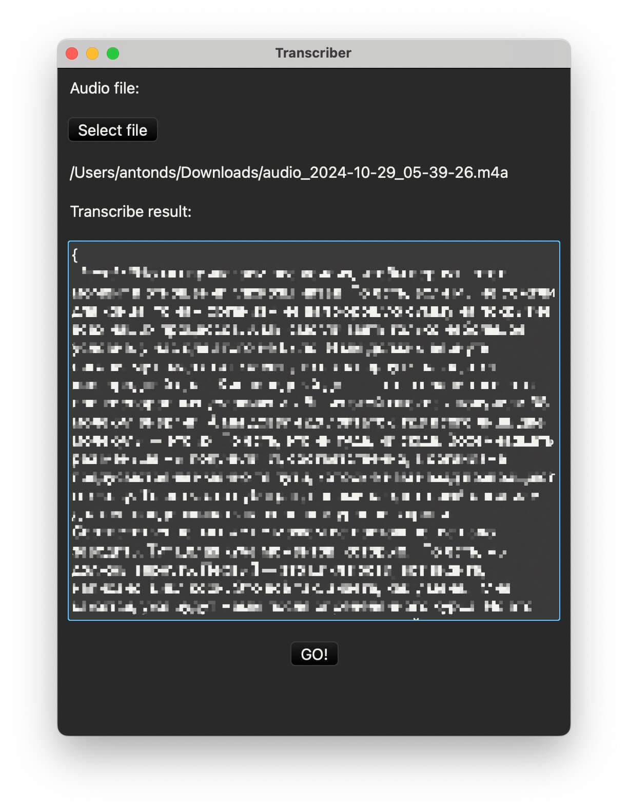

The project was created for educational purposes but performs a fully functional task — translating audio to text using OpenAI.

I didn't bother with saving the key through the UI, sorry, so just specify the key in the code before compiling `src/transcriber.rs:11`.

